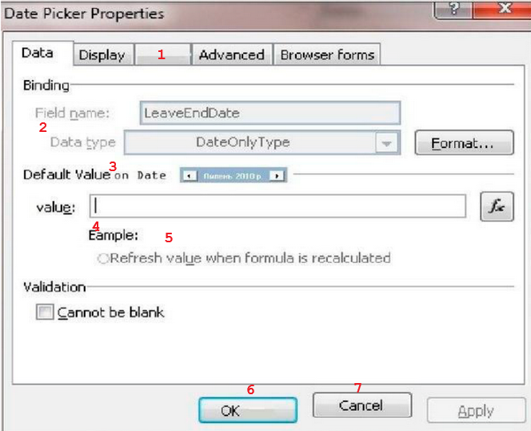

# Тестирование формы на ошибки пользовательского интерфейса

1. Нет кнопок _Свернуть_ и _Во весь экран_
2. Вкладка без названия
3. Не выровненный текст
4. Не выровненный текст
5. Разные шрифты
6. Непонятная хрень
7. С маленькой буквы
8. Не выровненная кнопка
9. Опечатка ("Eample" - "E***x***ample")
10. Не предоставлен пример
11. Не выровненный текст
12. Не выровненная кнопка
