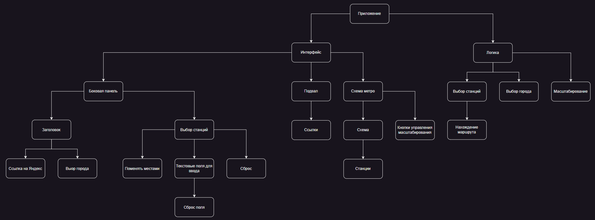

# Составление Mind Map и чек-листа

## Mind map

[Ссылка на draw.io файл.](files/Mind Map.drawio)

## Check-list

- [ ] Выбор города
- [ ] Ввод станций
- [ ] Сброс одной станции
- [ ] Сброс обеих станций
- [ ] Поменять местами
- [ ] Масштабирование
- [ ] Выбор станций
- [ ] Нахождение маршрута
- [ ] Ссылки
